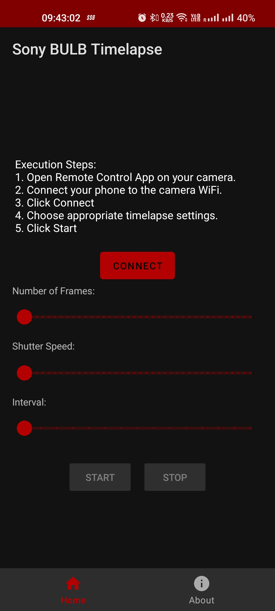

# Sony BULB Timelapse

An Android app for interval shooting using BULB exposure on Sony Alpha cameras. 

The motivation for this project comes from a lack of apps that allow interval shooting in the BULB exposure mode.

This app allows you to control your camera using WiFi remote access.

## Usage

This app is easy to use and comes with a simple, straightforward UI

    

## Steps

### 1. Prepare the Camera

- #### Sony camera with Playmemories support
  - Ensure that your camera has support for PlayMemories Apps.
  - Your camera must have the latest version of the [Smart Remote Control](https://www.playmemoriescameraapps.com/portal/usbdetail.php?eid=IS9104-NPIA09014_00-F00002) app installed.
  - Open the Smart Remote Control app and wait until the camera WiFi is turned ON.
- #### Other Sony camera
  - Select "Control with Smartphone" from the camera menu.
  - Wait until the camera WiFi is turned ON.

### 2. Connect to your Phone
- Connect your phone to the camera WiFi. The camera SSID usually starts with _"DIRECT-"_
- Open the Sony BULB Timelapse app and click "Connect"
- Once the Camera is connected, choose your interval shooting settings
- Click "Start" to begin shooting.

The app must remain ON at all times throughout the total duration.

## Supported Cameras

The app should work for most Sony cameras, however I cannot confirm it. 
I'd be happy to receive bug reports from other cameras.

I have tested the camera on these models so far:
- Sony A6000
- Sony A6100

## TODO
- Add a live view feature
- Keep app running in the background and return to state